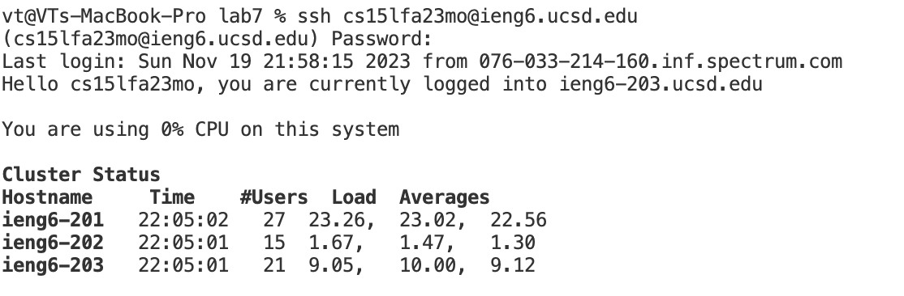
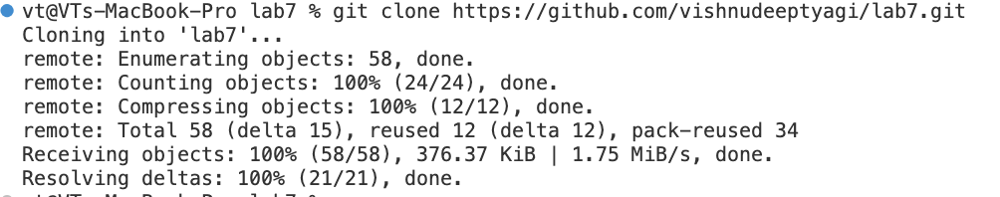
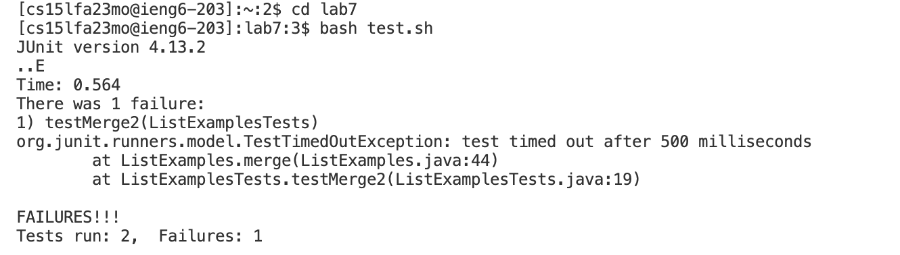
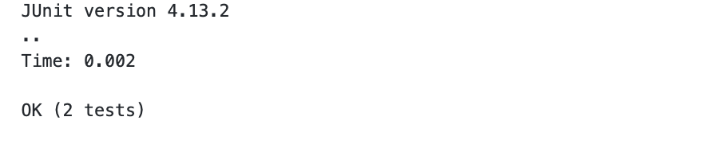
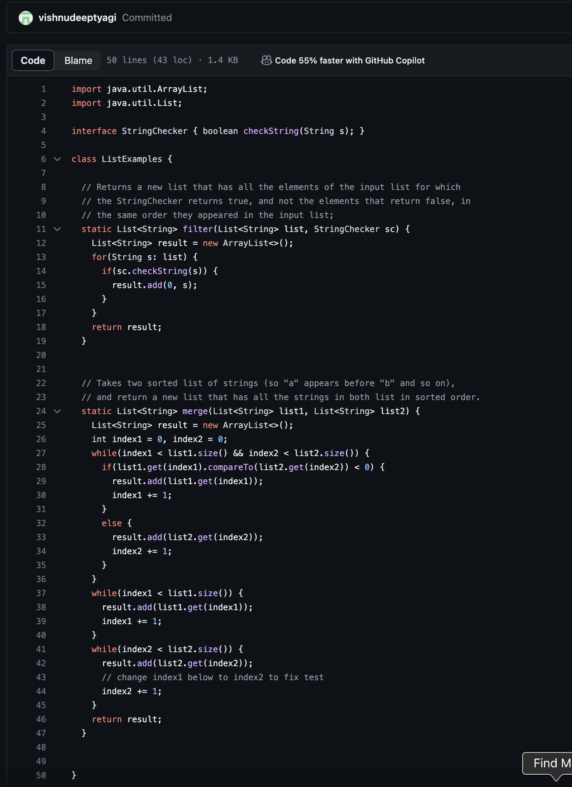

# LAB 4

## Step 1
Start the Timer

## Step 2 Log in
My course-specific account name character is mo. so I put in the command ```ssh cs15lfa23mo@ieng6.ucsd.edu```
Which gives:


## Step 3 Clone
Fork the lab from GitHub. Then clone the repo. To clone, copy the link to the repository and then run the command ```git clone https://github.com/vishnudeeptyagi/lab7.git``` 


## Step 4 Testing
First run the command ```cd lab7``` to enter that directory.
Then run the command ```bash test.sh``` to compile and run the files in the directory.
Here is the output: 

## Step 5 Rectification
Enter the appropriate file by running ```vim ListExamples.java```
Find the error by running ```/index1``` and then ```<Shift N>
Then where 1 is, enter ```x``` and then enter ```1```
Then enter ```2``` and press enter.
Exit file now

## Step 6 Testing

so, no errors anymore. Rectification successful 

## Step 7 Commit and push
To commit, run ```git add``` and then run ```git commit -m "Committed"```
Push changes by running ```git push```

Now you can see the changes on the repo:


So we can see that the changes were made successfully and that the changes were pushed.
